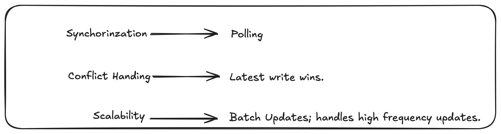

### Problem Statement
Many businesses use Google Sheets for collaborative data management and databases for more robust and scalable data storage. However, keeping the data synchronised between Google Sheets and databases is often a manual and error-prone process. Your task is to develop a solution that automates this synchronisation, ensuring that changes in one are reflected in the other in real-time.

## Developer's Section
Hi 👋!
The implementation is specific to google sheets and MySQL using python.
The problem statement presented a very benefical usecase, and I found out a lot of products are available in the market to solve this on a larger scale.
Google even has node support for this application!

In this repository, is my take on the same.

### To Run 🏃:
_prerequisites: python 3.8 or above installed, MySQL server installed_

- run `python -m pip install -r requirements.txt`
- Configure the [variables.env](./variables.env) with your MySQL server credentials and sheet_id.
- Configure the [Credentials.json](./Credentials.json) with your google cloud details, for more specifications see [here](https://console.cloud.google.com/apis/library/sheets.googleapis.com).
- Run basetable.sql in your MySQL database.
- You are all set!
- execute `python main.py` and the you will have your connection!

**Link to video** ➡️: [🔗] (https://drive.google.com/file/d/13qoSB5MhUInSsnRPfnhRSUhYtZu7Ufg3/view?usp=sharing)

### Approach

**Features planned but not completed due to time constraints:** ⏫
- API listeners (Flast/FastAPI) for changes.
- Object relational mapping using SQL alchemy

